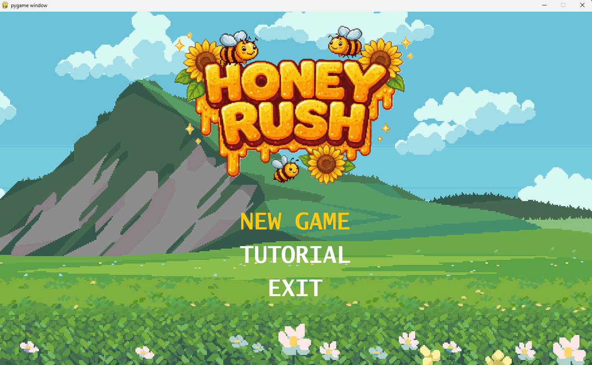

# 🍯Honey Hush - Demo
*Honey Rush* é um jogo de colheita em estilo pixel art desenvolvido em Python com a biblioteca Pygame. O jogador controla uma abelha que deve coletar flores em um cenário infinito enquanto desvia de predadores.

## 🎮 O Jogo
**Objetivo:** Coletar o máximo de flores possível para *ganhar pontos*.

**Controles:** Movimentação pelas teclas de seta.

**Desafio:** *Desviar dos inimigos* que tentam te capturar.

### 🚀 Tecnologias utilizadas neste projeto
**Linguagem:** Python.

**Biblioteca:** Pygame.

**Artes:**

|

|

## 💬 Notas pessoais

-

## 💛 Autoria

Made by **honey** 🐝

Sinta-se à vontade para entrar em contato comigo:

